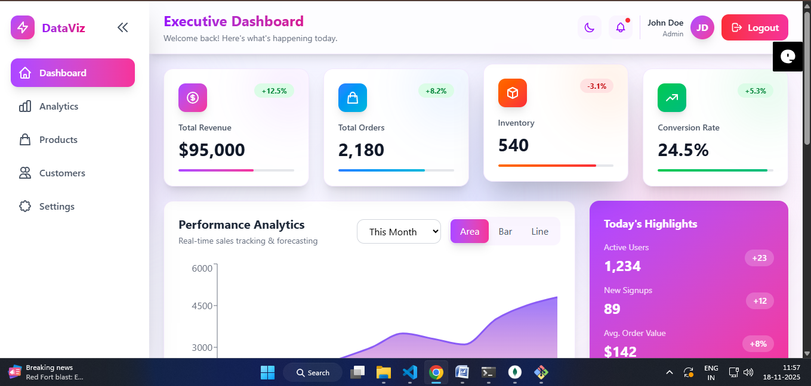
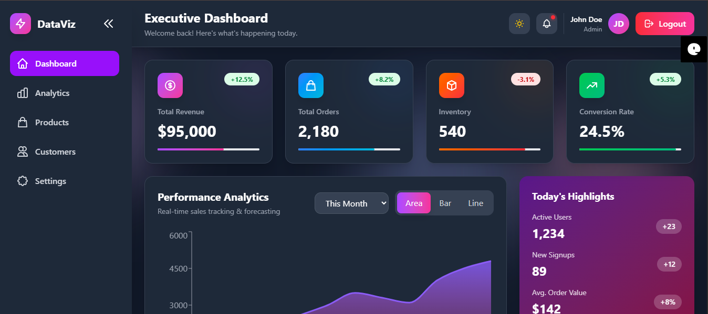
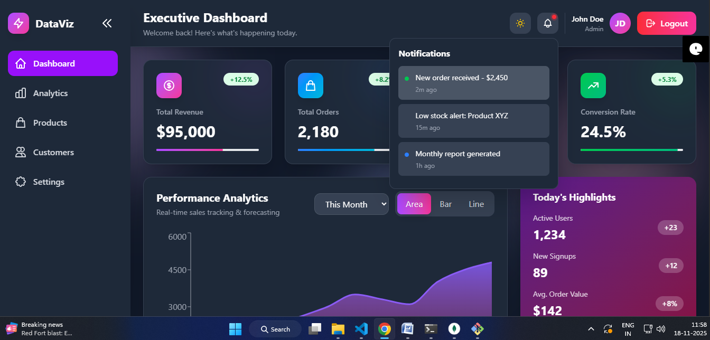

# Mini Hackathon Dashboard Project

A modern **MERN** (MongoDB, Express, React, Node.js) dashboard application that includes charts, key metrics, tables, and full user authentication.

---

## 📸 Screenshots

### 🔹 Dashboard UI


### 🔹 Dashboard Table View


### 🔹 Dashboard Dark Mode 1


### 🔹 Dashboard Dark Mode 2


### 🔹 Login Page


---

## 🚀 Features

* **Authentication (JWT):** Secure user sign-up and login using JSON Web Tokens.
* **Dashboard Metrics:** Display of key performance indicators (KPIs).
* **Charts:** Visual representations of data, including **Monthly Sales** and **Order trends**.
* **Orders Table:** A comprehensive table view with **sorting** and **filtering** capabilities.
* **Fully Responsive UI:** Optimized layout for all screen sizes (mobile, tablet, desktop).
* **Light / Dark Theme:** Options for users to switch between light and dark modes.

---

## 📦 Tech Stack

This project is built using the following technologies:

* **Frontend:**
    * **React** (with **Vite** for fast development)
    * **Tailwind CSS** (for styling)
* **Backend:**
    * **Node.js**
    * **Express**
* **Database:**
    * **MongoDB**
* **Authentication:**
    * **JWT Authentication**

---

## 🛠️ Setup Instructions

Follow these steps to get a copy of the project up and running on your local machine.

### Prerequisites

Ensure you have **Node.js** and **npm** installed.

### Installation

1.  **Clone the repository:**
    ```bash
    git clone [https://github.com/Shashank172003/mini_hackathon.git](https://github.com/Shashank172003/mini_hackathon.git)
    ```

2.  **Navigate to the project directory:**
    ```bash
    cd mini_hackathon
    ```

3.  **Install dependencies (for both client and server):**
    ```bash
    npm install
    ```

4.  **Create a `.env` file** in the root directory and add your MongoDB URI and JWT secret key (example structure below):
    ```
    MONGO_URI=your_mongodb_connection_string
    JWT_SECRET=your_secret_key
    ```

5.  **Run the application:**
    ```bash
    npm run dev
    ```
    This command typically starts both the frontend (React) and the backend (Express) concurrently.

---

## ✨ Author

**Shashank Nagvanshi**

---
